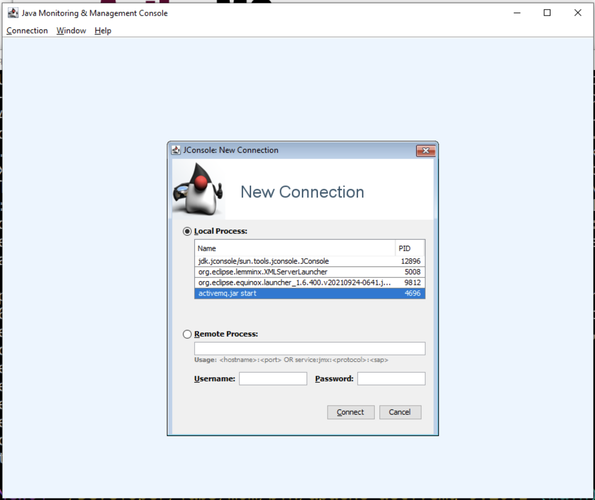

# MOM - (Message Oriented Middleware) - ActiveMQ


## Monitoring

 </img>

# References

- [ ] [ActiveMQ Performance Testing](https://www.javacodegeeks.com/2018/09/activemq-performance-testing.html)
- [ ] [REST with Spring Tutorial](https://www.baeldung.com/rest-with-spring-series)
- [ ] [Spring MVC and Scala for Platform.sh](https://github.com/platformsh-examples/scala)
- [ ] [Create an ActiveMQ image and push it to your own docker hub account !](https://medium.com/@bilal.asif.97/create-an-activemq-image-and-push-it-to-your-own-docker-hub-account-516a05eba10a)

- [ ] [Version :five: Getting Started](https://activemq.apache.org/version-5-getting-started.html)

```
 netstat -an|grep 61616
```
> Return
```
  TCP    0.0.0.0:61616          0.0.0.0:0              LISTENING
  TCP    [::]:61616             [::]:0                 LISTENING
  TCP    [::1]:61616            [::]:0                 LISTENING
```
