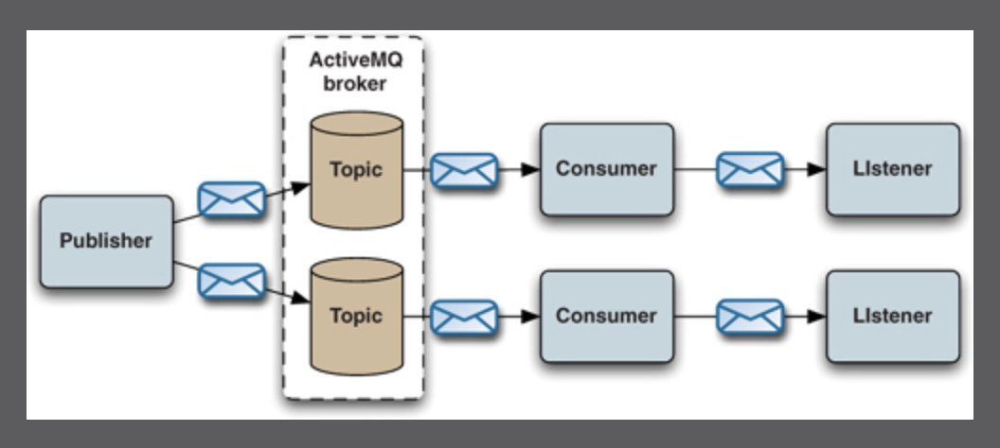

# Chapter :nine:	:heavy_minus_sign: ActiveMQ messaging for other languages

- [ ] 1 coding activity  based on the Publisher example

 </img>

| Source Code |  Transport | Available |
|-------------|--|----|
| [ch9](src/main/java/org/apache/activemq/book/ch9) |  [STOMP (Streaming Text Oriented Messaging Protocol)](https://activemq.apache.org/stomp) | :heavy_check_mark: |
| Python | [pyactivemq]https://code.google.com/archive/p/pyactivemq) | :heavy_minus_sign: No longer maintained |

# [:back: ](..) Return to Part:three:

# References

- [ ] External `Maven` Libraries used for this chapter

| Maven Libraries                                                                                                       |
|-----------------------------------------------------------------------------------------------------------------------|
| [javax.jms/javax.jms-api/2.0.1](https://mvnrepository.com/artifact/javax.jms/javax.jms-api/2.0.1)                     |
| [org.apache.activemq/activemq-all/5.16.2](https://mvnrepository.com/artifact/org.apache.activemq/activemq-all/5.16.2) |
