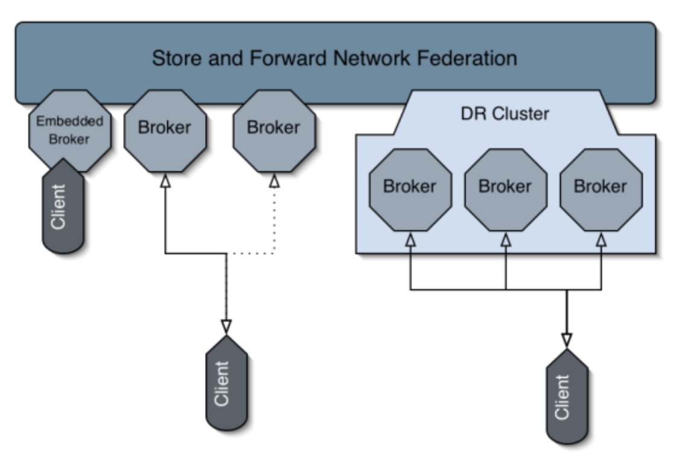
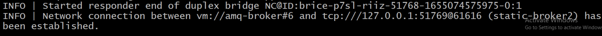
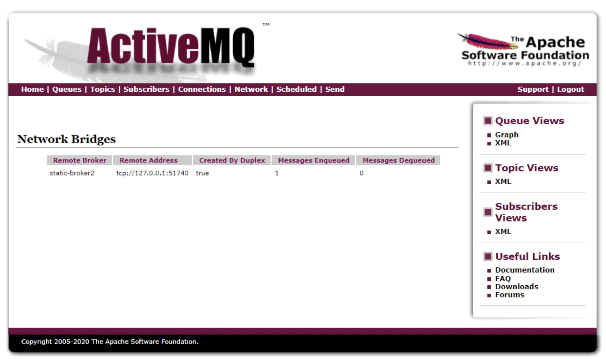

# Chapter :one::zero:

 </img>

 </img>

 </img>

# References

:round_pushpin: Features

- [ ] [Features > New Features > New Features in 5.13](https://activemq.apache.org/new-features-in-513)

- [ ] [Features > Clustering](https://activemq.apache.org/clustering)

  Clustering is a large topic and often means different things to different people. We’ll try to list the various aspects of clustering and how they relate to ActiveMQ

- [ ] [Features > Clustering > Networks of Brokers](https://activemq.apache.org/networks-of-brokers.html)

:round_pushpin: Using ActiveMQ

- [ ] [Using ActiveMQ > Topologies](https://activemq.apache.org/topologies)

